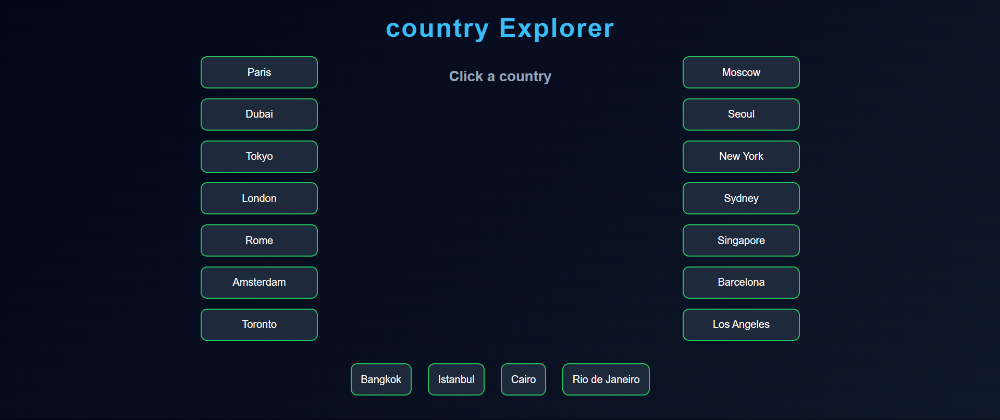
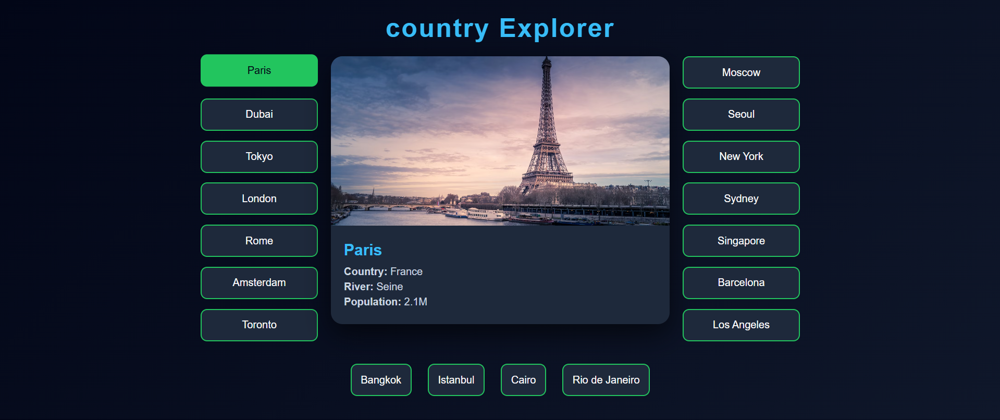
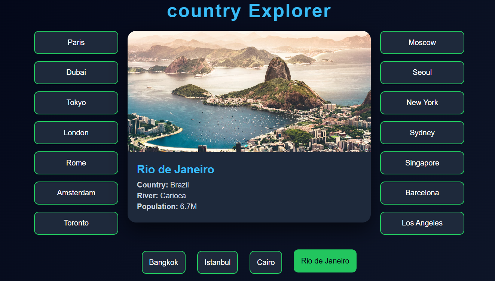

# 🌆 City Explorer App

<p align="center">
  
</p>

<p align="center">
  🚀 Explore Cities • 📸 Beautiful UI • ⚡ Fast & Interactive
</p>

---

## 🧠 About The Project

City Explorer is a React-based web application where users can explore different cities around the world.  
Click on any city card to view detailed information like country, river, and population.

---

## ✨ Features

- 🌍 18 Unique Cities
- 🖱️ Click to View Details
- 🖼️ HD City Images
- ⚡ Fast Performance
- 🎨 Clean UI Design
- 📱 Responsive Layout

---

## 📸 Screenshots

<p align="center">
  
  
  
</p>

---

## 📸 View in Country

<p align="center">
  
</p>

<p align="center">
  
</p>

<p align="center">
  
</p>

---

## 🛠️ Tech Stack

| Technology | Use |
|-----------|-----|
| React JS  | Frontend |
| TypeScript / JS | Logic |
| CSS       | Styling |

---

## 📂 Folder Structure


city-explorer/
│
├── src/
│ ├── App.tsx
│ ├── Box.tsx
│ ├── styles.css
│
├── public/
├── package.json
└── README.md


---

## 💻 Sample Component

```jsx
<Box
  text="Paris"
  img="https://images.unsplash.com/photo-1502602898657-3e91760cbb34"
  country="France"
  river="Seine"
  population="2.1M"
  setMessage={setCity}
/>
```

⚙️ Installation & Setup
# Clone the repository

git clone :- https://github.com/your-username/city-explorer.git

# Go to project folder
cd city-explorer

# Install dependencies
- npm init
- npm run dev

👤 Your Name


GitHub: https://github.com/your-username

⭐ Support

If you like this project, give it a ⭐ on GitHub!

📜 License

This project is open-source and free to use.