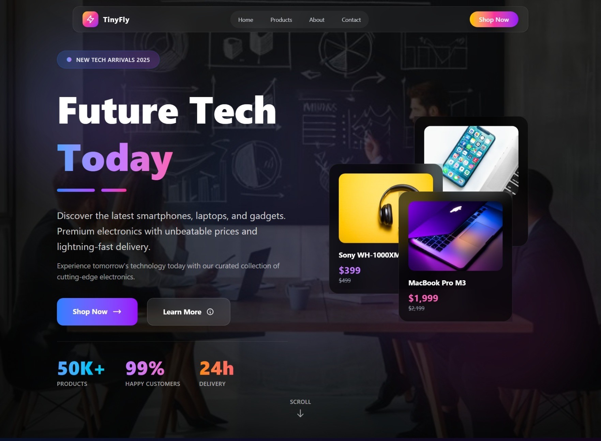
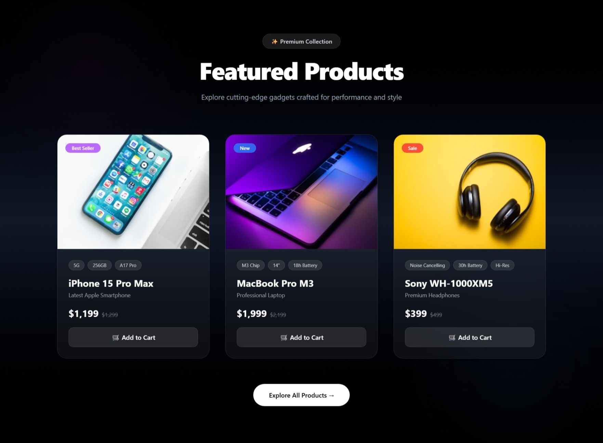
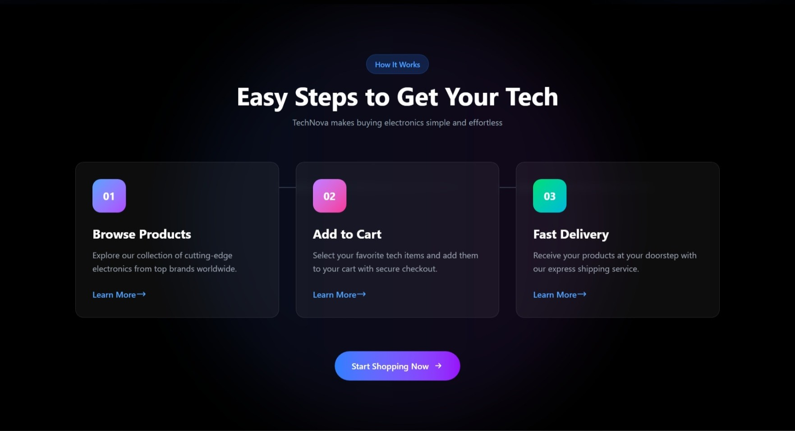

# 🚀 TechNova - React UI Project

A modern and responsive **React-based UI project** built using reusable components and state management.
This project showcases a premium product UI with smooth interactions and clean design.

---

## 📸 Project Preview

### 🏠 Home Page


---

### 🛍️ Products Section



---

### 📱 Responsive View



---

### 📱 Responsive View


---
### 📱 Responsive View


---
### 📱 Responsive View



---
### 📱 Responsive View


---

## 🛠️ Tech Stack

* ⚛️ React JS
* 🎨 Tailwind CSS
* 🧠 useState Hook
* 💡 Component-Based Architecture

---

## 📂 Project Structure

```
src/
 ├── assets/
 │    └── products/
 │
 ├── components/
 │    ├── Navbar.jsx
 │    ├── Featured.jsx
 │    ├── About.jsx
 │    └── Contact.jsx
 │
 ├── App.jsx
 └── main.jsx
```

---

## ⚙️ Features

* 🔥 Modern Glassmorphism UI
* 📱 Fully Responsive Design
* 🧩 Reusable Components
* 🎯 Hover Animations
* 🛒 Product Cards UI
* ⚡ Smooth Transitions

---

## 🧩 Component Architecture

The UI is built using reusable and scalable components:

| Component  |  Purpose         |
| ---------  |  --------------- |
| Navbar     |  Navigation bar  |
| Featured   |  Product listing |
| About      |  Company info    |
| Contact    |  Contact section |


## 🧠 State Management

This project uses the **useState hook** to manage UI interactions.

```js
const [hovered, setHovered] = useState(null);
```

👉 Used for:

* Product hover effects
* Dynamic UI behavior
* Interactive UI elements

---

## 🧩 Component System

The UI is divided into reusable components:

* `Navbar` → Navigation
* `Featured` → Products Section
* `About` → Info Section
* `Contact` → Contact Form

```js
import Navbar from "./components/Navbar";
import Featured from "./components/Featured";

function App() {
  return (
    <>
      <Navbar />
      <Featured />
    </>
  );
}
```

---

## 🚀 How to Run

```
npm install
npm run dev
```

---

## 👨‍💻 Author

Developed by **Krushik**

---

## ⭐ Support

If you like this project, give it a ⭐ on GitHub!
